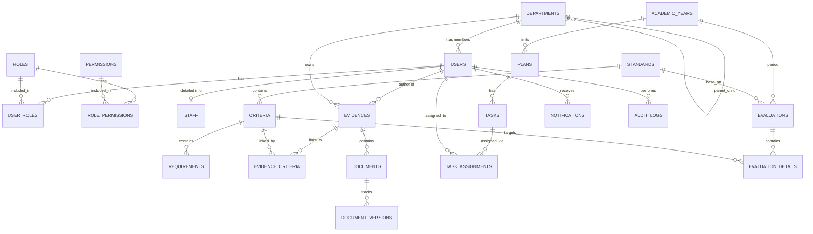

# STQMS Database Design
## 1. Overview
Thiết kế cơ sở dữ liệu cho hệ thống STQMS (Standard Training Quality Management System) sử dụng PostgreSQL.
Thiết kế tập trung vào tính toàn vẹn dữ liệu, khả năng mở rộng và hỗ trợ quy trình workflow (đặc biệt là Evidence).

## 2. Design Decisions & Standards
- **Primary Keys:** Sử dụng `UUID` để đảm bảo tính duy nhất toàn cục, bảo mật (không đoán được ID) và hỗ trợ phân tán dữ liệu sau này.
- **Timestamps:** Tất cả các bảng chính đều có `created_at` và `updated_at`.
- **Soft Deletes:** Sử dụng cột `is_active` hoặc `is_deleted` để không xóa cứng dữ liệu quan trọng.
- **Audit Logging:** Sử dụng bảng `audit_logs` với kiểu dữ liệu `JSONB` cho `old_values` và `new_values` để dễ dàng tra cứu lịch sử thay đổi mà không làm thay đổi schema.
- **Evidence Workflow:** Bảng `evidences` có cột `status` (DRAFT, PENDING, APPROVED, REJECTED) để track tiến trình.
- **Many-to-Many cho Evidence - Criteria:** Bảng `evidence_criteria` cho phép một minh chứng (Evidence) được tái sử dụng cho nhiều tiêu chí (Criteria) khác nhau.

## 3. Entity Relationship Diagram (ERD)

## 4. Alembic Migration Strategy (Backend Phase)
Khi tích hợp vào Backend (FastAPI + SQLAlchemy), cấu trúc migration sẽ được quản lý bởi Alembic:
- `alembic/versions/001_initial_schema.py`: Chứa toàn bộ cấu trúc tạo bảng cơ sở.
- `alembic/versions/002_seed_initial_data.py`: Seed data cho Role, Permission, Admin User.
Không bao giờ sửa trực tiếp `001_initial_schema.py` sau khi đã chạy lên production/staging. Mọi thay đổi tiếp theo (thêm cột, sửa kiểu dữ liệu) phải nằm ở file migration mới (`003_...`).
